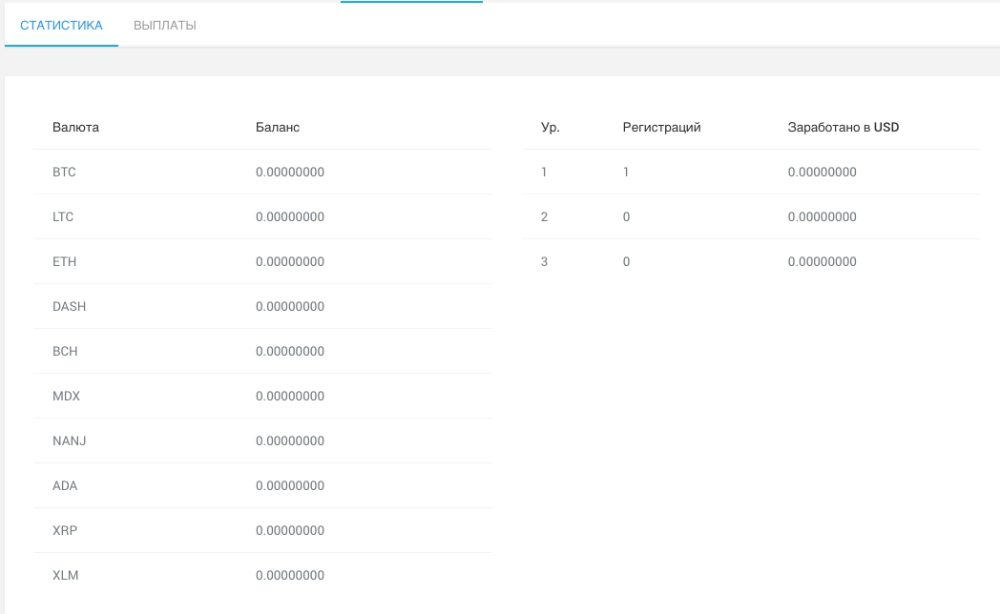

# Инструменты

## Торговая площадка \(биржа\)

Представляет из себя торговый терминал для работы с которым пользователю необходимо иметь на своем [биржевом счету](bank-1.md#tipy-schetov) положительный баланс. 

На текущий момент на бирже представлены к торговле следующие валютные пары \(90 пар\):

* MDX/BTC MDX/ETH MDX/USD MDX/EUR MDX/GBP MDX/JPY MDX/CNY MDX/BCH MDX/LTC MDX/DASH MDX/NANJ MDX/RUB ETH/BTC BTC/USD BTC/EUR BTC/GBP BTC/JPY BTC/CNY BCH/ETH ETH/USD ETH/EUR ETH/GBP ETH/JPY ETH/CNY BCH/BTC LTC/ETH BCH/USD BCH/EUR BCH/GBP BCH/JPY BCH/CNY LTC/BTC LTC/USD LTC/EUR LTC/GBP LTC/JPY LTC/CNY DASH/ETH DASH/BTC DASH/USD DASH/EUR DASH/GBP DASH/CNY NANJ/ETH NANJ/BTC NANJ/USD NANJ/EUR NANJ/GBP NANJ/JPY NANJ/CNY BTC/RUB ETH/RUB LTC/RUB DASH/RUB MDX/HKD BTC/HKD ETH/HKD BCH/HKD LTC/HKD DASH/HKD NANJ/HKD ADA/BTC ADA/ETH ADA/USD ADA/EUR ADA/GBP ADA/HKD ADA/JPY ADA/CNY MDX/ADA NEO/BTC NEO/ETH NEO/USD NEO/EUR NEO/GBP NEO/HKD NEO/JPY NEO/CNY MDX/NEO DST/BTC BTC/USDT ETH/USDT LTC/USDT MDX/USDT USDT/USD USDT/HKD TRX/BTC TRX/ETH TRX/USDT DST/ETH

Пользователю доступны инструменты технического анализа: TradingView. 

Интерфейсные возможности терминала:

* Просмотр истории торгов по выбранной валютной паре
* Просмотр котировок из процент изменения за сутки
* Просмотр своей истории торгов
* Просмотр своих открытых ордеров
* Просмотр доступных к взаимодействию ордеров, поставленных другими пользователями
* Интерактивный чат с администраторами или другими пользователями. Отдельный чат для каждого языка: 

## Агрегатор котировок

Пользователь получает возможность наблюдать за котировками по выбранной валютной паре на любой из ТОПовых криптовалютных бирж на одном экране, производить анализ изменения цены, а также отслеживать его на групповом графике

Котировки обновляются автоматически и предоставляют пользователю актуальную информацию.

## Кошелек \(виртуальное хранилище\)

Используется для хранения средств пользователя и их перевода куда-либо. Кошелек защищен средствами защиты аккаунта:

* двуфакторная авторизация
* шифрование
* https
* e-mail подтверждение всех расходных операций
* логирование

Для каждой криптовлюты  [генерируется уникальный адрес пополнения](../cryptohub/vvedenie-sryptohub.md#generaciya-adresov), за процесс генерации адреса отвечает сервис [СryptoHub](../cryptohub/vvedenie-sryptohub.md), который также отвечает за все внешние транзакции. Каждый кошелек имеет свой уникальный ID, который также является и ID пользователя.

Для работы с фиатными валютами подключены и настроены следующие шлюзы:

*  WireTransfer \(создана собственная панель администрирования и работа через безопасный удаленный сервер\)
* ZOTA Pay
* Connectum

Для дополнительной безопасности, для учетной записи пользователя существует процедура KYC, которая в настоящий моент производится через интеграцию с сервисом  SUM & Substance, при этом мы также имеем техническую возможность отказаться от этого сервиса и производить верификацию пользователя своими силами.

## **Создание MDX-кодов** 

Пользователь может создать уникальный цифровой код в котором будет зашифровано нужное ему количество средств в выбранной валюте.

 После создания кода баланс пользователя уменьшается на указанную в коде величину, а код становится доступен для передачи другому пользователю или самостоятельной последующей активации.

 При активации кода баланс пользователя пополняется на зашифрованную в коде сумму и код считается погашенным и больше не подлежит использованию. 

## **Переводы другому пользователю**

Пользователь может отправить или получить перевод внутри системы при наличии необходимого баланса на своих счетах. Чтобы отправить перевод необходимо указать ID получателя.

## **Обмен с другим пользователем \(Эскроу\)**

Пользователь имеет возможность совершить обмен с другим пользователем безопасно, без риска не получить средства в ответ. Для этого один пользователь отправляет другому заявку на обмен. В этот момент на его счету замораживается предлагаемая к обмену сумма. 

Второй пользователь которому адресовано предложение об обмене может отклонить его или принять. В случае принятия с его счета списывается требуемая для обмена сумма, а в обмен зачисляются замороженные ранее средства первого пользователя. Пользователь может одновременно иметь любое количество предложений на обмен.

## **Оплата** **и выставление счетов**

Каждый пользователь может создать счет на оплату и выставить его другому пользователю передав уникальную ссылку, полученную в результате создания счета. Ссылка открывает уникальную страницу с информацией об выставленном счете и может быть доступна без авторизации на сайте. Однако для оплаты по счету необходима авторизация. Каждый пользователь может создавать любое количество счетов.

## Реферальная програма

Нами разработана трехуровневая реферальная программа для стимулирования привлечения новых пользователей.

