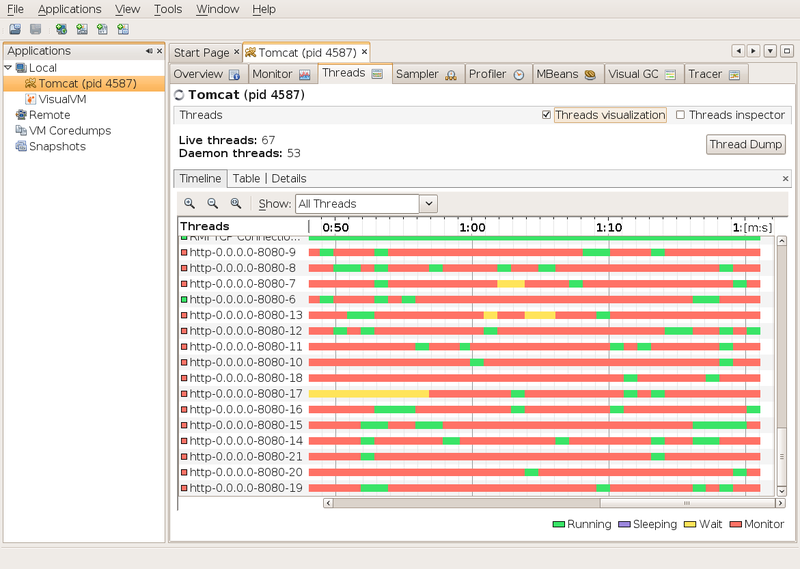
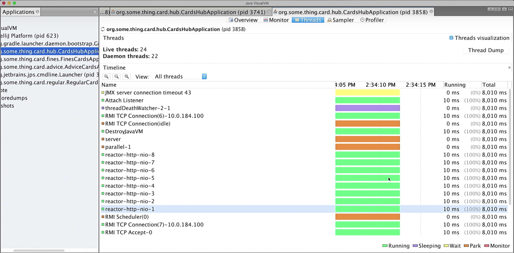

# Gateways

## FIX ****

Fix gateway is split in 2 parts. First one, Connector, manages TCP connection and is responsible for fix-recovery \(old messages re-reshipment\), another one, Handler, processes events.

Connector and Handler may communicate via IPC if they are on same server, or via UDP if they work on different servers. Communication protocol over UDP gives same guarantees as TCP but works faster. Same protocol is used for communications between all services launched on different servers.

One pair of Connector + Handler may process approximately 300 000 Fix-messages \(NewOrderSingle\) in second according to our tests. Test includes fix message decoding, convertation to inner protocol and shipment to exchange core.

Depending on loads, more Connector or Handler instances may be added.

## **Rest**

Rest Gateways is build using Multi-Coring and Non-Blocking instead of multi-threading principles. We use Netty for http requests.

Most Java servers, such as Tomcat, create new thread for each connection. It leads several important problems: 

* Thread creation is long and heavy task
* Thread is often doesn't do anything. It waits for request loading, parsing, other inner requests, waits for responses, combines all together as response for user, sends it to user and makes sure that response is sent.
* Thread switching is a long operation as well

Rest Gateways take another approach. When this gateway is started, for each core on thread is created. Threads process users' requests. On thread may keep multiple http connections.

Comparison of "MultiThreading" and "MultiCoring & Non-Blocking" approaches:

## **Web Socket**

Exchange events are broadcasted to WebSocket connections via [Centrifugo](https://github.com/centrifugal/centrifugo).  

After successful WebSocket connection client may subscribe to channels.

There are two types of channels: public and private. Public channels share public events - order book change, new deals. Private - user's orders updates and deals.

## **Binary Protocol**

We need to add binary protocol to Trading Engine to decrease latency and increase throughput.

