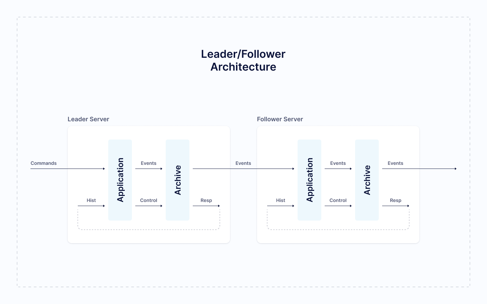

# Replication

It is unsafe to keep all data on one server. If this server breaks, all data will be lost.

**All Trading Engine's data are stored simultaneously on several servers.** If one server breaks down, data won't be lost. ****

**Server which copies data is called replica.** Process of data copy on different servers is called replication.

**Количество реплик настраивается.** Обычно мы используем две реплики.

**Amount of replicas is customisable.** We usually use 2 replicas. 

The more replicas system has, the more reliable it is. The cost is speed, so there should be balance between reliability and performance in terms of replicas count.

## How replication is done

Replication is shown on scheme. Server with business logic may be run in 2 configurations: Leader or Follower.

* `Node` - server, which consists of 2 modules: `application` and `archive`, contains business logic and writes events to drive.
  * `Leader` — configuration when `node` may produce events
  * `Follower` — configuration when `node` subscribes to `Leader's` events
* `Application` — Trading Engine's business logic. [More on page «Modules»](modules.md#spisok-modulei).
* `Archive` — модуль сохранения данных, последовательно записывает поток сообщений на диск.
* `Archive` - data storage module, writes event stream consistently to drive

Как работает нода:

* `Application` обрабатывает команду и генерирует события. `Follower` пропускает этот этап.
* События применяются к внутреннему состоянию `application` и публикуются.
* Из `application` события отправляются в `archive`. 
* `Archive` записывает событие на диск и публикует его.

Как работает нода во время запуска:

* `Application` отправляет `archive` запрос на получение старых событий. 
* `Archive` считывает с диска события и публикует. 
* События из `archive` передаются в `application`.
* `Application` применяет события к внутреннему состоянию.

