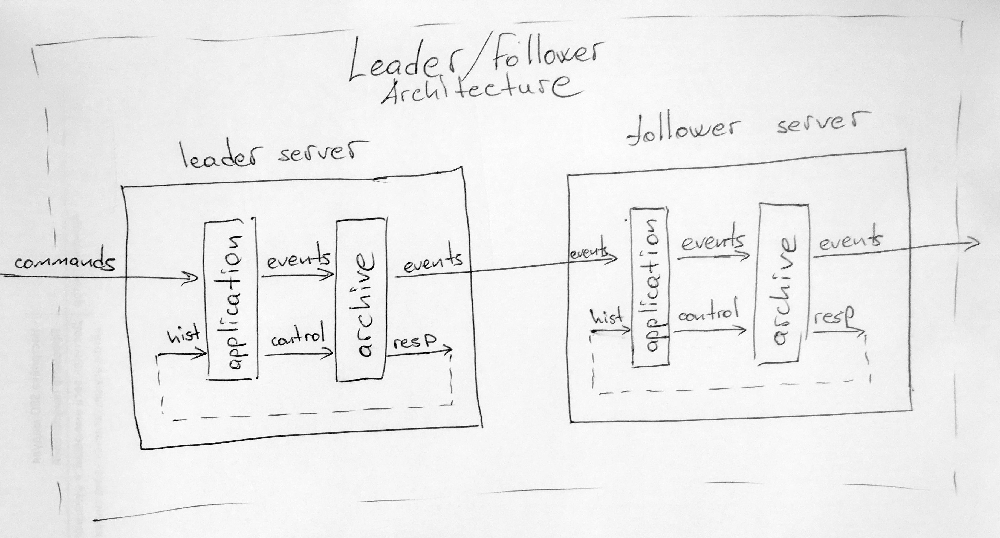

# Репликация

Хранить все данные на одном сервере — ненадежно. Данные потеряются, если сервер выйдет из строя.

Все данные Trading Engine хранятся одновременно на нескольких серверах. Если какой-то сервер выйдет из строя, данные не потеряются.

Копирование данных на другие сервера в режиме реального времени мы называем репликацией.  
Копию данных называем репликой.

Количество реплик настраивается. Обычно мы используем две реплики.

Чем больше реплик, тем надежнее хранятся данные и тем медленнее работает система. Поэтому выбор количества реплик — поиск баланса надежности и производительности.


Чем больше реплик, тем надежнее система, но тем медленнее она работает.


## Как устроена репликация

На схеме показано, как работает репликация в Trading Engine. Сервер с бизнес логикой запускается в двух режимах: Leader и Follower. 

* `Node` — сервер, состоит из двух модулей: `application` и `archive`, содержит бизнес логику и сохраняет события на диск.
  * `Leader` — режим, в котором `нода` создает события.
  * `Follower` — режим, в котором `нода` подписывается на события `Leader`.
* `Application` — бизнес логика Trading Engine. [Подробнее на странице «Модули»](multi-server.md#spisok-modulei).
* `Archive` — модуль сохранения данных, последовательно записывает поток сообщений на диск.

Node data flow:

* `Application` обрабатывает команду и генерирует события. `Follower` пропускает этот этап.
* События применяются к внутреннему состоянию `application` и публикуются.
* Из `application` события отправляются в `archive`. 
* `Archive` записывает событие на диск и публикует его.

Node data flow во время запуска:

* `Application` отправляет `archive` запрос на получение старых событий. 
* `Archive` считывает с диска события и публикует. 
* События из `archive` передаются в `application`.
* `Application` применяет события к внутреннему состоянию.

